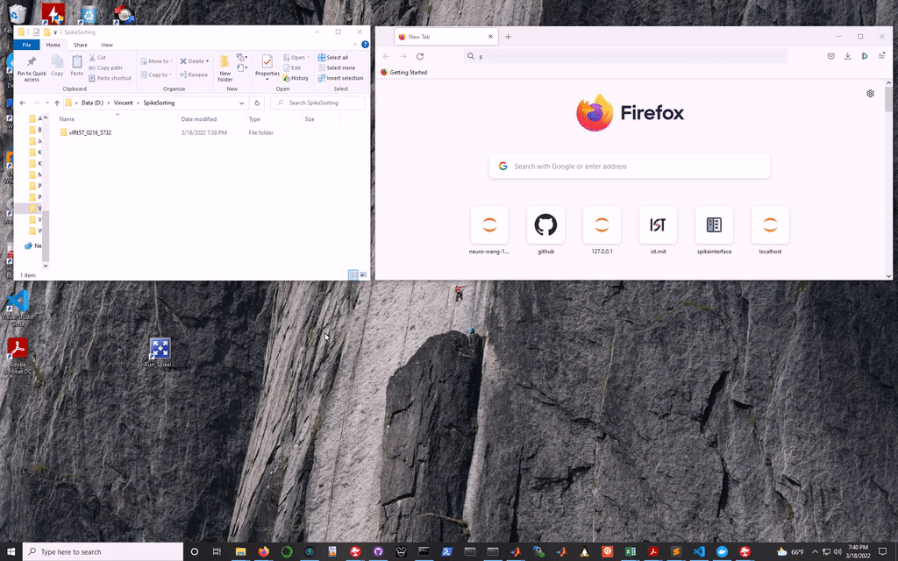

### How to run the spikeinterface container
**Method 1: drag and drop**  (Windows only for now)  
Drag and drop the data folder on either `.bat` file (see `launch_scripts` folder).  For convenience, create a shortcut and put it on your desktop.

_Which launch script should you pick?_   
  
  `SpikeInterface_OneOff.bat` will start a one-off sesssion. The container will self-destroy upon shutdown (not just closing the tab though). If the tab is closed, go back to your session at this address: http://localhost:8888/lab?token=mytoken.  
   
  `SpikeInterface_Persist.bat` will start a persistent container that can be reused. The drawback is that data folder will stay the same until the container is stopped and remove (which can be done following instructions below).  
In the `.bat`, please replace "mytoken" by some other word of your choice.  

To add files and notebooks to your session, drag and drop them on the left side mneu.  
Files can be downloaded with right-click > download.   
  
**Method 2: manual start**  
1. Open a terminal and navigate to the data directory. Then follow these instructions.  
2. Start the container  
*On Linux/MacOS*  
`export JUPYTER_TOKEN='mytoken'`
`docker run -d --rm --name spikeinterface -v "${PWD}":/home/jovyan/data -p 8888:8888 -e JUPYTER_TOKEN spikeinterface/spikeinterface:0.2`  
*On Windows*  
`set JUPYTER_TOKEN=mytoken`
`docker run -d --rm --name spikeinterface -v "%CD%":/home/jovyan/data -p 8888:8888 -e JUPYTER_TOKEN spikeinterface/spikeinterface:0.2`  
  
  * Replace "mytoken" by some other word. 
  * If you built the image (see below), remove `spikeinterface/` or replace it with your docker handle. 
  
3. Then open http://localhost:8888/lab?token=mytoken in a browser.   

**Important Note**  
The `--rm` flag means the container is a one-off (will self-destroy upon closure). 
To make the container persitant, remove the `--rm flag` from the docker call. In which case, the container will persist. To start a stopped container, run `docker start spikeinterface` in a terminal, or use the Docker Desktop interface to start it.  

### How to build this image
The container image is [available on DockerHub](https://hub.docker.com/repository/docker/spikeinterface/spikeinterface/). Providing you have Docker installed, it will automatically download when starting the container. 

If you want to build it, follow the instructions below.
Open a terminal, navigate to the spikeinterface directory, then run:   
`docker build -t spikeinterface:0.2 .`  
On Linux systems, you can also use the build script (after making it executable `chmod +x build.sh`):    
`./build.sh`  

  

